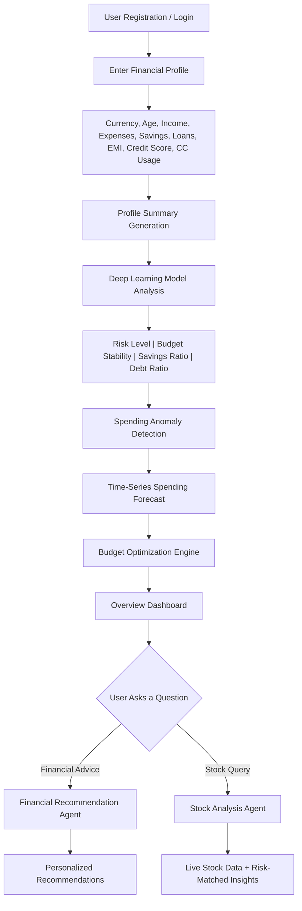

# AI Financial Decision System — Complete Project Analysis

## 1. Problem Statement

**What real-world problem is this project solving?**

Most people lack the financial literacy and analytical tools to manage their money effectively. They struggle with:
- **No visibility** into whether their spending habits are healthy or risky
- **No early warning** when spending becomes abnormal (e.g., sudden 2× jump in food expenses)
- **No personalized guidance** — generic budgeting apps don't factor in your credit score, loans, EMI burden, and savings ratio together
- **No connection between personal finances and investment decisions** — people invest in stocks without understanding whether they can afford the risk

**Why is this problem important?**

Poor financial decisions lead to debt traps, insufficient savings, and failed investments. An AI system that understands a user's *complete* financial profile can provide data-driven, personalized guidance — something that would normally require an expensive financial advisor.

---

## 2. Objective of the Project

Build a **full-stack AI Financial Decision System** that:

1. Collects a user's financial profile (income, expenses, savings, loans, credit score, etc.)
2. **Predicts financial risk** using a deep learning model trained on 100,000+ financial profiles
3. **Detects spending anomalies** automatically
4. **Forecasts future spending** using time-series analysis
5. **Optimizes budgeting** by suggesting category-level expense reductions
6. **Provides profile-aware stock insights** — combining the user's risk level with live market data
7. Routes user queries intelligently to the appropriate AI agent (financial advice vs. stock analysis)

**Final Goal:** A production-quality web application with a Flask backend, deep learning models, and a polished dark-themed frontend dashboard.

---

## 3. How the System Works (High-Level Flow)

### Step-by-Step:

| Step | Action | Detail |
|------|--------|--------|
| 1 | **Registration/Login** | User creates account or logs in |
| 2 | **Financial Profile Input** | Collects 9 financial parameters with currency detection (₹/\$) |
| 3 | **Deep Learning Prediction** | Neural network predicts Risk Level, Budget Stability, Savings Ratio, Debt Ratio |
| 4 | **Anomaly Detection** | Isolation Forest / Z-score flags unusual spending |
| 5 | **Spending Forecast** | LSTM/ARIMA predicts next-month spending by category |
| 6 | **Budget Optimization** | Engine suggests specific expense cuts and quantifies savings impact |
| 7 | **Investment Capacity** | Calculates safe investment amount after emergency buffer |
| 8 | **Query Handling** | User asks financial questions → classified and routed to correct agent |
| 9 | **Agent Response** | Financial Agent gives budget advice; Stock Agent gives market insights |

---

## 4. Key Features / Functionalities

| Feature | Description |
|---------|-------------|
| **User Auth** | Register/Login with secure sessions |
| **Financial Profile Dashboard** | Visual summary of income, expenses, risk, and ratios |
| **Deep Learning Risk Prediction** | TensorFlow neural network classifies risk as Low/Medium/High |
| **Budget Stability Score** | 0-100 score indicating financial health |
| **Spending Anomaly Detection** | Auto-flags abnormal expenses using Isolation Forest |
| **Time-Series Spending Forecast** | LSTM/ARIMA predicts future spending trends |
| **AI Budget Optimizer** | Suggests category-level expense reductions with impact estimates |
| **Investment Capacity Calculator** | Safe monthly investment amount after emergency buffer |
| **AI Query Assistant** | Chatbot that classifies queries and routes to the right agent |
| **Stock Analysis Dashboard** | Real-time stock data with price, volatility, P/E ratio, trends |
| **Profile-Aware Stock Insights** | Matches stock risk to user's financial risk profile |
| **Multi-Currency Support** | INR (₹) and USD (\$) with dynamic symbols |

---

## 5. Technologies & Concepts Involved

| Category | Technologies |
|----------|-------------|
| **Language** | Python 3.10+ |
| **Backend Framework** | Flask (REST API) |
| **Deep Learning** | TensorFlow / Keras (Risk prediction model) |
| **Time-Series ML** | LSTM neural network, ARIMA/Prophet |
| **Anomaly Detection** | Isolation Forest (scikit-learn), Z-score |
| **Data Processing** | pandas, NumPy, scikit-learn |
| **Stock Data** | yfinance API (real-time market data) |
| **Database** | SQLite (user profiles, transaction history) |
| **Frontend** | HTML, CSS, JavaScript (dark-themed dashboard) |
| **Visualization** | Chart.js (frontend charts), Matplotlib (backend) |
| **Dataset** | 100,000+ profiles (real Kaggle data + synthetic augmentation) |
| **Auth** | Flask-Login / session-based authentication |

---

## 6. Type of Solution

This is a **hybrid AI system** combining:

| Type | What It Does |
|------|-------------|
| **Prediction System** | Predicts financial risk level and spending trends |
| **Anomaly Detection System** | Flags abnormal spending automatically |
| **Recommendation System** | Suggests budget optimizations and financial strategies |
| **Decision Support System** | Provides stock insights matched to user's risk profile |
| **Intelligent Agent System** | Routes queries to specialized AI agents |

---

## 7. Expected Output / Result

### Dashboard Output:
- **Risk Level Badge**: LOW RISK / MEDIUM RISK / HIGH RISK
- **Budget Stability Score**: 0-100 with stability label
- **Savings Ratio**: Percentage with monthly savings amount
- **Debt Ratio**: Percentage with monthly EMI amount
- **Income vs. Expenses Chart**: Bar chart comparison
- **Expense Category Breakdown**: Donut chart by category
- **Risk Assessment Card**: Detailed risk explanation

### AI Query Output:
- **Financial Advice**: "Reducing shopping by 10% could save ₹3,000/month"
- **Stock Insights**: "TCS volatility: Medium. Based on your Low Risk profile, this stock aligns with your risk tolerance."

---

## 8. Real-World Use Cases

| Use Case | Description |
|----------|-------------|
| **Personal Finance Management** | Individuals managing monthly budgets and savings goals |
| **Loan Applicants** | Understanding debt-to-income ratio before applying for loans |
| **New Investors** | Understanding investment capacity before entering the stock market |
| **Financial Advisors** | Tool to quickly profile and assess client financial health |
| **Banking Apps** | Embedded financial wellness feature for banking customers |
| **Corporate HR** | Employee financial wellness programs |
| **FinTech Startups** | Core engine for budgeting or robo-advisory platforms |

---

## 9. Impact / Value

| Impact | Detail |
|--------|--------|
| **Early Risk Detection** | Users know their financial risk before it becomes a crisis |
| **Automated Anomaly Alerts** | Catches spending problems users might not notice manually |
| **Data-Driven Budgeting** | Replaces guesswork with ML-optimized budget suggestions |
| **Safe Investment Guidance** | Prevents over-investment by calculating safe capacity |
| **Accessibility** | Democratizes financial advisory — no expensive advisor needed |
| **Multi-Currency** | Usable across INR and USD economies |

---

## 10. Possible Improvements

| Improvement | Description |
|-------------|-------------|
| **Real Bank Integration** | Connect to Plaid or Open Banking APIs for automatic transaction import |
| **NLP-Powered Chatbot** | Use LLM (GPT/Gemini) for natural language financial conversations |
| **Goal-Based Planning** | "I want to save ₹5 lakh in 2 years" — system creates a plan |
| **Multi-Currency Auto-Detect** | Auto-detect currency from user's location |
| **Mobile App** | React Native or Flutter mobile version |
| **Advanced Portfolio Optimization** | Modern Portfolio Theory for multi-stock allocation |
| **Recurring Anomaly Patterns** | Detect seasonal spending patterns (festivals, holidays) |
| **Explainable AI** | SHAP/LIME explanations for why risk level was predicted |
| **Cloud Deployment** | Deploy on AWS/GCP with scalable microservices |
| **Multi-User Household** | Family budgeting with shared expense tracking |

---

## 11. Detailed UI Analysis (From Screenshots)

### Design System
- **Theme**: Dark mode with deep navy/charcoal background (`#0a0e1a` → `#1a1e2e`)
- **Cards**: Dark cards (`#1e2235`) with subtle glowing borders (`rgba(100,120,255,0.15)`)
- **Accent Colors**: Blue (`#4a7dff`) for primary buttons, Green (`#22c55e`) for positive values, Red (`#ef4444`) for negative, Orange for warnings
- **Typography**: Clean sans-serif, white text on dark backgrounds
- **Navbar**: Centered pill-style buttons with blue highlight for active tab, "Finance AI" branding in blue on left, "Hello, username" + Logout on right

---

### Page 1: Login / Register

| Element | Specification |
|---------|--------------|
| **Layout** | Centered card on full dark background |
| **Title** | "Finance AI" bold heading |
| **Tabs** | Login (blue underline when active) &#124; Register |
| **Fields** | Username input, Password input (dark inputs with light borders) |
| **Button** | "Continue" — full-width blue button (`#4a7dff`) |

---

### Page 2: Overview Dashboard (Top Section)

| Element | Specification |
|---------|--------------|
| **Welcome Banner** | Purple gradient banner: "Welcome back, {name}! 👋" |
| **Sub-text** | "Here's your complete financial snapshot" |
| **Badges** | Pill badges: `Age 30 years`, `Credit Score 720`, `Risk Tolerance High` |

**Metric Cards Row** (5 cards):

| Card | Content |
|------|---------|
| **Risk Level** | Badge "LOW RISK" (green) or "MEDIUM/HIGH" &#124; Subtitle: "Based on debt ratio & credit score" |
| **Budget Stability** | Large number `99 /100` &#124; Label "Stable" &#124; Blue progress indicator |
| **Savings Ratio** | `40.0%` green &#124; "Monthly Savings ₹2,000" |
| **Debt Ratio** | `0.0%` &#124; "Monthly EMI ₹0" |
| **Quick Actions** | 3 buttons: ⊕ Add Transaction →, ⚙ Update Profile →, 🤖 AI Advice → |

**Bottom Row** (3 cards):

| Card | Content |
|------|---------|
| **🛡 Risk Assessment** | ✅ "Low Risk Risk — Excellent financial health!" &#124; Recommendations below |
| **💰 Income vs Expenses** | Bar chart (Chart.js) — green income bar, smaller blue expense bar, Y-axis 0–10K |
| **🔥 Expense Categories** | Donut/ring chart — colored segments per category (Shopping, Food, etc.) |

---

### Page 3: Overview Dashboard (Scrolled Down — Bottom Sections)

| Card | Content |
|------|---------|
| **⚠️ Financial Anomalies** | "AI detected unusual patterns" &#124; Alert card with ⚠ icon: "Unusual Savings — Detected an unusual savings value of ₹10,000" &#124; `HIGH` red badge |
| **📊 Spending Forecast** | "AI-powered future spending estimates" &#124; "Next Month Estimated: ₹3,200" (green) &#124; "Next 3 Months Total: ₹9,600" (green) &#124; "Method: DNN + Prophet Hybrid" |
| **🚀 AI Budget Optimization** | "Strategies to improve your financial health score." &#124; Bullet: "Great savings percentage! Consider investing in FDs or Mutual Funds to beat inflation." |
| **💎 Investment Capacity** | "Safe capital available for dynamic market allocation." &#124; Large centered: "₹800" &#124; "Calculated by AI based on surplus & macro-signals" |

---

### Page 4: Recent Transactions Table

| Element | Specification |
|---------|--------------|
| **Header** | "📋 Recent Transactions — Your latest 10 transactions" &#124; `+ Add New` blue button (right) |
| **Columns** | 📅 Date &#124; 🏷 Category &#124; 📝 Description &#124; Type &#124; ₹ Amount |
| **Category badges** | Colored pill badges (green "Bonus", blue "Fruits", pink "Beauty") |
| **Type badges** | Green "INCOME" or red "EXPENSE" pill |
| **Amount** | Green `+ ₹10,000` for income, Red `- ₹1,000` / `- ₹500` for expenses |

---

### Page 5: Add Financial Details

| Element | Specification |
|---------|--------------|
| **Title** | "Add Financial Details" (blue gradient text) |
| **Tabs** | Income &#124; Expenses (blue active tab) |
| **Expense Categories** | Vertical list of buttons: Shopping, Food (green active), Phone, Entertainment, Education, Beauty, Sports, Social |
| **Button Style** | Dark gray cards, green highlight when selected, full-width |

---

### Page 6: AI Query Assistant

| Element | Specification |
|---------|--------------|
| **Title** | "AI Query Assistant — Ask about your financial profile" |
| **Chat Layout** | Left-aligned bot messages (dark bubbles), right-aligned user messages (blue bubbles) |
| **Bot greeting** | "Hello! How can I help with your finances today?" |
| **User query** | "analyze tcs" (blue bubble, right-aligned) |
| **Bot response** | "I have generated a detailed stock analysis. Redirecting you to the Stock Analysis dashboard..." |
| **Input** | Placeholder "e.g. How can I reduce my expenses?" &#124; Blue "Send" button |

---

### Page 7: Stock Analysis Dashboard

| Element | Specification |
|---------|--------------|
| **Header** | Stock name: "TATA CONSULTANCY SERV LT" &#124; Ticker badge: `TCS.NS` &#124; Price: `₹2,358.9` &#124; Change: `-30.9 (-1.29%)` red |
| **Sub-tabs** | Overview (blue active) &#124; Fundamentals &#124; Valuation &#124; News |
| **Key Stats card** | Sector: Technology &#124; Market Cap: ₹8.53 Lakh Cr &#124; Volume: 68,02,477 &#124; AI Confidence: 85% |
| **Ask AI Agent panel** | "Analyzing TCS.NS" &#124; Chat with AI response about market signals, trend analysis &#124; Input: "Ask me anything about this stock." &#124; Blue "Send" button |
